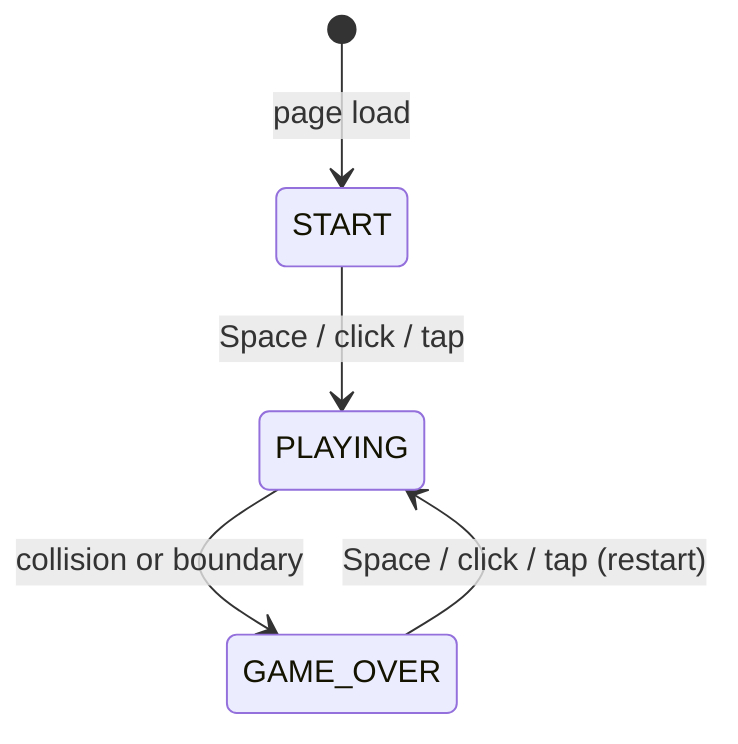
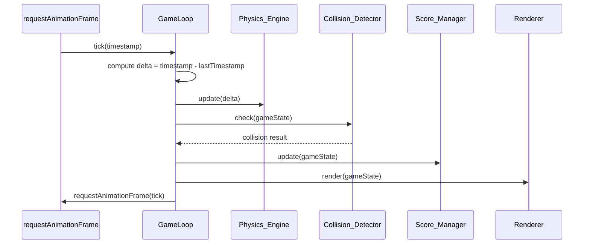
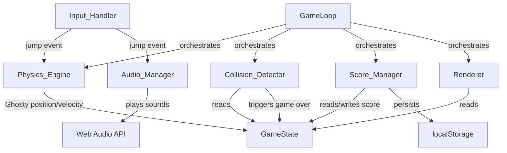

# Design Document: Flappy Kiro

## Overview

Flappy Kiro is a browser-based endless scroller game implemented as a **single HTML file** with no build step or server-side dependencies. The player controls Ghosty — a ghost character sprite — through a gauntlet of scrolling pipe obstacles and cloud hazards. The game uses HTML5 Canvas for rendering, the Web Audio API for sound effects, and `localStorage` for high score persistence.

The architecture follows a classic **game loop pattern**: a fixed-timestep update cycle driven by `requestAnimationFrame` that separates physics/logic updates from rendering. All game components are plain JavaScript objects/classes embedded in the HTML file.

### Key Design Decisions

- **Single-file, no build step**: All JS and CSS are embedded in `index.html`. Assets (`ghosty.png`, `jump.wav`, `game_over.wav`) are loaded at runtime from the `assets/` directory.
- **Delta-time physics**: All movement and physics are expressed in units per second and multiplied by the elapsed time (delta) each frame, ensuring frame-rate independence.
- **State machine**: The game progresses through discrete states (`START`, `PLAYING`, `GAME_OVER`) to cleanly separate behavior.
- **Component decomposition**: Logic is split into focused components (Physics_Engine, Collision_Detector, Renderer, Audio_Manager, Score_Manager, Input_Handler) that communicate through a shared `GameState` object.

---

## Architecture

### High-Level Flow



### Game Loop



### Component Interaction



---

## Components and Interfaces

### GameState

Central shared object holding all mutable game data. All components read from and write to this object.

```js
GameState {
  phase: 'START' | 'PLAYING' | 'GAME_OVER',
  ghosty: GhostyState,
  pipes: PipePair[],
  clouds: Cloud[],
  score: number,
  highScore: number,
  canvas: HTMLCanvasElement,
  ctx: CanvasRenderingContext2D,
  lastTimestamp: number,
  nextPipeX: number,   // x-coordinate at which the next pipe spawns
  nextCloudX: number,  // x-coordinate at which the next cloud spawns
}
```

### Physics_Engine

Responsible for applying gravity and jump impulses to Ghosty each frame.

```js
PhysicsEngine {
  GRAVITY: 1200,          // px/s²
  JUMP_VELOCITY: -500,    // px/s (upward)
  MAX_FALL_SPEED: canvas.height,  // px/s (1 canvas height per second)

  update(ghosty, delta): void
  applyJump(ghosty): void
}
```

- `update` adds `GRAVITY * delta` to `ghosty.vy` each frame, clamps `vy` to `[JUMP_VELOCITY, MAX_FALL_SPEED]`, then updates `ghosty.y += ghosty.vy * delta`.
- `applyJump` sets `ghosty.vy = JUMP_VELOCITY` (replaces current velocity, preventing stacking).

### Collision_Detector

Performs AABB (axis-aligned bounding box) collision checks each frame.

```js
CollisionDetector {
  check(ghosty, pipes, clouds, canvasHeight): CollisionResult
}

CollisionResult {
  collided: boolean,
  reason: 'pipe' | 'cloud' | 'top' | 'bottom' | null
}
```

- Ghosty's bounding box: `{ x: ghosty.x, y: ghosty.y, w: ghosty.width, h: ghosty.height }`
- Pipe bounding boxes: top pipe `(pipeX, 0, PIPE_WIDTH, gapTop)` and bottom pipe `(pipeX, gapBottom, PIPE_WIDTH, canvasHeight - gapBottom)`
- Cloud bounding box: `(cloud.x, cloud.y, cloud.width, cloud.height)`
- Boundary checks: `ghosty.y <= 0` (top) or `ghosty.y + ghosty.height >= canvasHeight` (bottom)

### Renderer

Draws all game elements to the canvas each frame using the sketchy/hand-drawn style (stroke outlines, no solid fills).

```js
Renderer {
  drawBackground(ctx, canvas): void
  drawGhosty(ctx, ghosty, image): void
  drawPipes(ctx, pipes): void
  drawClouds(ctx, clouds): void
  drawScoreBar(ctx, score, highScore, canvas): void
  drawStartScreen(ctx, canvas, ghosty, image): void
  drawGameOverScreen(ctx, canvas, score, highScore): void
}
```

Sketchy style is achieved by using `ctx.strokeRect`, `ctx.strokeStyle`, and `ctx.lineWidth` with a slightly irregular stroke (jitter applied to coordinates) to simulate a hand-drawn look.

### Audio_Manager

Loads and plays sound effects using the HTML `Audio` element (simpler than Web Audio API for this use case, with graceful degradation).

```js
AudioManager {
  sounds: { jump: HTMLAudioElement | null, gameOver: HTMLAudioElement | null },
  ready: boolean,

  preload(): void
  playJump(): void
  playGameOver(): void
}
```

- `preload` creates `Audio` objects for each sound file and attaches `onerror` handlers that log a console warning and set the sound to `null`.
- `playJump` / `playGameOver`: if the sound is non-null, resets `currentTime = 0` then calls `.play()`. Errors from `.play()` (e.g., autoplay policy) are caught and silently ignored.
- Audio is deferred until the first user interaction (first jump) to satisfy browser autoplay policies.

### Score_Manager

Tracks score and persists high score.

```js
ScoreManager {
  STORAGE_KEY: 'flappyKiroHighScore',

  loadHighScore(): number
  saveHighScore(score: number): void
  checkAndUpdateHighScore(score: number, highScore: number): number
}
```

- `loadHighScore`: reads from `localStorage`, parses as integer, returns 0 if missing or invalid.
- `saveHighScore`: writes to `localStorage`.
- `checkAndUpdateHighScore`: returns `Math.max(score, highScore)`.

### Input_Handler

Attaches event listeners for keyboard, mouse, and touch input.

```js
InputHandler {
  onJump: () => void,   // callback set by GameLoop

  attach(canvas): void
  detach(): void
}
```

- Listens for `keydown` (Space), `mousedown`, and `touchstart` on the canvas/document.
- Calls `onJump()` on any of these events.
- Prevents default touch behavior to avoid scroll interference.

---

## Data Models

### GhostyState

```js
GhostyState {
  x: number,          // fixed horizontal position (e.g., 20% of canvas width)
  y: number,          // current vertical position (top-left of bounding box)
  vy: number,         // current vertical velocity (px/s)
  width: number,      // rendered width (from image natural size or fixed 48px)
  height: number,     // rendered height (from image natural size or fixed 48px)
}
```

### PipePair

```js
PipePair {
  x: number,          // left edge of the pipe pair
  gapCenterY: number, // vertical center of the gap
  gapHeight: number,  // height of the gap (≥ 2 × ghosty.height)
  width: number,      // pipe width (fixed, e.g., 60px)
  scored: boolean,    // true once Ghosty has passed the midpoint
}
```

Derived values:

- `gapTop = gapCenterY - gapHeight / 2`
- `gapBottom = gapCenterY + gapHeight / 2`
- Top pipe: `(x, 0)` to `(x + width, gapTop)`
- Bottom pipe: `(x, gapBottom)` to `(x + width, canvasHeight)`

### Cloud

```js
Cloud {
  x: number,          // left edge
  y: number,          // top edge
  width: number,      // randomized width (e.g., 80–140px)
  height: number,     // randomized height (e.g., 40–70px)
  speed: number,      // scroll speed (40–60% of pipe speed = 60–90 px/s)
}
```

### Constants

```js
PIPE_SPEED = 150; // px/s
PIPE_INTERVAL = 200; // px (leading-edge-to-leading-edge)
PIPE_WIDTH = 60; // px
GAP_MIN_RATIO = 0.2; // gap center min: 20% of canvas height
GAP_MAX_RATIO = 0.8; // gap center max: 80% of canvas height
CLOUD_SPEED_MIN = 0.4; // fraction of PIPE_SPEED
CLOUD_SPEED_MAX = 0.6; // fraction of PIPE_SPEED
CLOUD_INTERVAL_MIN = 200; // px
CLOUD_INTERVAL_MAX = 400; // px
GRAVITY = 1200; // px/s²
JUMP_VELOCITY = -500; // px/s
```

---

## Correctness Properties

_A property is a characteristic or behavior that should hold true across all valid executions of a system — essentially, a formal statement about what the system should do. Properties serve as the bridge between human-readable specifications and machine-verifiable correctness guarantees._

### Property 1: Ghosty velocity is always clamped within bounds

_For any_ sequence of physics updates (any combination of gravity applications and jump impulses, in any order), Ghosty's vertical velocity `vy` SHALL always remain within the range `[JUMP_VELOCITY, MAX_FALL_SPEED]` after each update.

**Validates: Requirements 2.5, 2.6**

---

### Property 2: Physics update formula holds for any delta time

_For any_ initial Ghosty state `(y, vy)` and any positive delta time `dt`, after one physics update the new position SHALL equal `y + vy_clamped * dt` and the new velocity SHALL equal `clamp(vy + GRAVITY * dt, JUMP_VELOCITY, MAX_FALL_SPEED)`.

**Validates: Requirements 2.1, 2.4**

---

### Property 3: Jump impulse always replaces velocity

_For any_ Ghosty state with any current vertical velocity `vy`, applying a jump impulse SHALL set `vy` to exactly `JUMP_VELOCITY`, regardless of the prior velocity value.

**Validates: Requirements 2.2, 2.6**

---

### Property 4: Pipe spawn invariants hold for any canvas size

_For any_ canvas height `h` and any Ghosty height `g`, a spawned PipePair SHALL satisfy both: (a) `gapCenterY` is within `[0.20 × h, 0.80 × h]`, and (b) `gapHeight >= 2 × g`.

**Validates: Requirements 3.3, 3.4**

---

### Property 5: Off-screen entities are always removed from the active set

_For any_ game state after any number of scroll updates, no PipePair or Cloud whose right edge `(x + width)` is less than `0` SHALL remain in the active pipes or clouds arrays.

**Validates: Requirements 3.5, 4.4**

---

### Property 6: Cloud spawn invariants hold for any canvas size

_For any_ canvas height `h`, a spawned Cloud SHALL satisfy both: (a) `cloud.y` is within `[0.20 × h, 0.80 × h]`, and (b) `cloud.speed` is within `[0.40 × PIPE_SPEED, 0.60 × PIPE_SPEED]`.

**Validates: Requirements 4.2, 4.3**

---

### Property 7: Any obstacle overlap triggers game over

_For any_ Ghosty bounding box and any PipePair or Cloud bounding box that geometrically overlaps with Ghosty's bounding box, the game phase SHALL transition to `GAME_OVER`.

**Validates: Requirements 5.1, 5.2**

---

### Property 8: Any boundary violation triggers game over

_For any_ Ghosty state where `ghosty.y <= 0` (top boundary) or `ghosty.y + ghosty.height >= canvasHeight` (bottom boundary), the game phase SHALL transition to `GAME_OVER`.

**Validates: Requirements 5.3, 5.4**

---

### Property 9: Score equals the count of pipes passed

_For any_ sequence of PipePairs, the current score SHALL equal the exact count of PipePairs whose `scored` flag is `true`, and each PipePair's `scored` flag SHALL transition from `false` to `true` at most once.

**Validates: Requirements 6.1**

---

### Property 10: High score update is the maximum of score and prior high score

_For any_ final score `s` and prior high score `h`, after the game-over high score update, the new high score SHALL equal `max(s, h)`.

**Validates: Requirements 6.3**

---

### Property 11: High score localStorage round-trip preserves value

_For any_ valid non-negative integer `n`, writing `n` to localStorage under key `"flappyKiroHighScore"` and then reading it back SHALL return `n`; and for any non-numeric or missing stored value, `loadHighScore` SHALL return `0`.

**Validates: Requirements 6.4, 6.5**

---

### Property 12: High score is preserved across restarts

_For any_ high score value `h` at the time of game restart, after the restart completes the high score SHALL still equal `h`.

**Validates: Requirements 7.2**

---

### Property 13: Sound re-trigger always resets playback to the beginning

_For any_ audio element in any playback state (playing, paused, or ended), triggering the same sound again SHALL reset `currentTime` to `0` before calling `play()`.

**Validates: Requirements 8.4**

---

## Error Handling

### Audio Failures

- If `assets/jump.wav` or `assets/game_over.wav` cannot be loaded, `AudioManager` logs a `console.warn` and stores `null` for that sound. All play calls check for `null` before attempting playback.
- If `.play()` returns a rejected Promise (e.g., autoplay policy), the rejection is caught silently. The game continues without audio.
- Audio is not attempted until the first user interaction to comply with browser autoplay restrictions.

### localStorage Failures

- `Score_Manager.loadHighScore` wraps the `localStorage.getItem` call in a try/catch. If `localStorage` is unavailable (e.g., private browsing with storage disabled), it returns `0`.
- `Score_Manager.saveHighScore` wraps `localStorage.setItem` in a try/catch and logs a `console.warn` on failure. The game continues with an in-memory high score.
- If the stored value is not a valid non-negative integer (e.g., corrupted data), `loadHighScore` returns `0`.

### Canvas / Rendering Failures

- If `getContext('2d')` returns `null` (unsupported browser), the game displays a static error message in the HTML body and does not attempt to start the game loop.

### Asset Loading

- `ghosty.png` is loaded via an `Image` object. If it fails to load, Ghosty is rendered as a simple filled rectangle as a fallback, so the game remains playable.
- Sound assets follow the graceful degradation path described above.

### Viewport Resize

- On `window.resize`, the canvas dimensions are updated to match the new viewport. Active game state (Ghosty position, pipe positions) is preserved. Ghosty's position is clamped to the new canvas bounds to prevent out-of-bounds states.

---

## Testing Strategy

### Overview

This game is a single-file browser application with pure JavaScript logic. The testing strategy uses two complementary approaches:

1. **Property-based tests** for the pure logic components (Physics_Engine, Collision_Detector, Score_Manager, pipe/cloud spawning)
2. **Example-based unit tests** for specific behaviors, edge cases, and UI interactions

The game logic (physics, collision, scoring) is extracted into pure functions that can be tested in isolation without a browser DOM. The rendering and audio components are tested with mocks.

### Property-Based Testing

**Library**: [fast-check](https://github.com/dubzzz/fast-check) (JavaScript, runs in Node.js with no browser required)

**Configuration**: Minimum 100 iterations per property test (`numRuns: 100`).

**Tag format**: Each property test is tagged with a comment:
`// Feature: flappy-kiro, Property N: <property_text>`

Properties to implement as property-based tests:

| Property    | Test Description                                                                                                                  |
| ----------- | --------------------------------------------------------------------------------------------------------------------------------- |
| Property 1  | Generate arbitrary sequences of gravity updates and jump inputs; assert `vy` stays in `[JUMP_VELOCITY, MAX_FALL_SPEED]`           |
| Property 2  | Generate arbitrary `(y, vy, dt)` tuples; assert position and velocity update formulas hold                                        |
| Property 3  | Generate arbitrary `vy` values; assert jump always sets `vy = JUMP_VELOCITY`                                                      |
| Property 4  | Generate arbitrary canvas heights and Ghosty heights; assert spawned pipe satisfies both gap center bounds and minimum gap height |
| Property 5  | Generate arbitrary scroll sequences; assert no pipe or cloud with `x + width < 0` remains in active arrays                        |
| Property 6  | Generate arbitrary canvas heights; assert spawned cloud satisfies both y-position bounds and speed bounds                         |
| Property 7  | Generate arbitrary Ghosty/obstacle bounding box pairs that overlap; assert game transitions to `GAME_OVER`                        |
| Property 8  | Generate arbitrary Ghosty y values at or beyond boundaries; assert game transitions to `GAME_OVER`                                |
| Property 9  | Generate arbitrary sequences of pipes passed; assert score equals count of `scored === true` pipes                                |
| Property 10 | Generate arbitrary `(score, highScore)` pairs; assert updated high score equals `max(score, highScore)`                           |
| Property 11 | Generate arbitrary non-negative integers and invalid strings; assert localStorage round-trip and invalid-input defaulting         |
| Property 12 | Generate arbitrary high score values; assert high score is unchanged after restart                                                |
| Property 13 | Generate arbitrary audio playback states; assert `currentTime === 0` after re-trigger                                             |

### Example-Based Unit Tests

- **Start screen**: Ghosty is centered vertically; no pipes or clouds are active.
- **Game over screen**: Final score and high score are displayed; game loop is halted.
- **Restart**: Score resets to 0; pipes and clouds are cleared; Ghosty returns to start position.
- **Audio graceful degradation**: Missing audio file does not throw; game continues.
- **localStorage invalid data**: Corrupted or missing high score defaults to 0.
- **Boundary collision**: Ghosty at `y = 0` triggers game over; Ghosty at `y = canvasHeight` triggers game over.
- **Pipe removal**: Pipes that scroll off-screen are removed from the active set.
- **Score increment**: Score increments exactly once per pipe pair passed.

### Integration / Smoke Tests

- **Canvas initialization**: `getContext('2d')` succeeds in a browser environment.
- **Asset loading**: `ghosty.png` loads without error in a browser environment.
- **requestAnimationFrame loop**: Game loop runs at ≥ 30 fps in a modern browser (manual verification).
